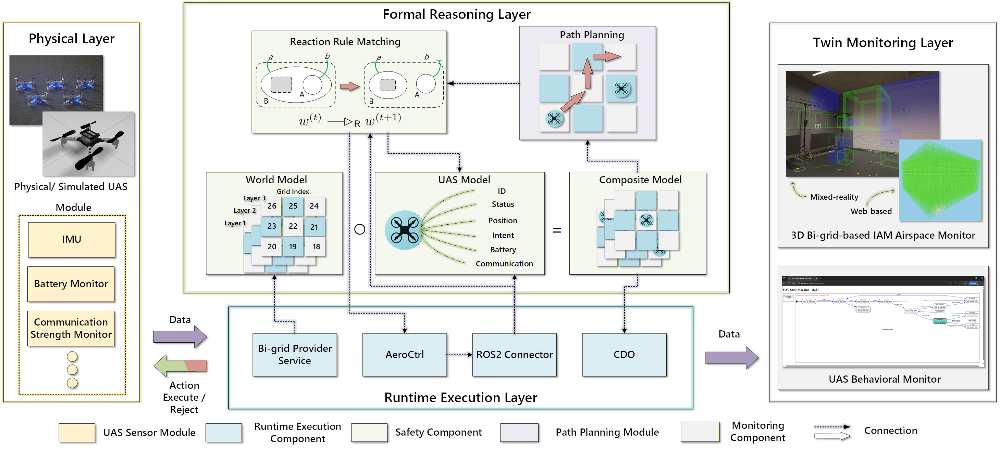
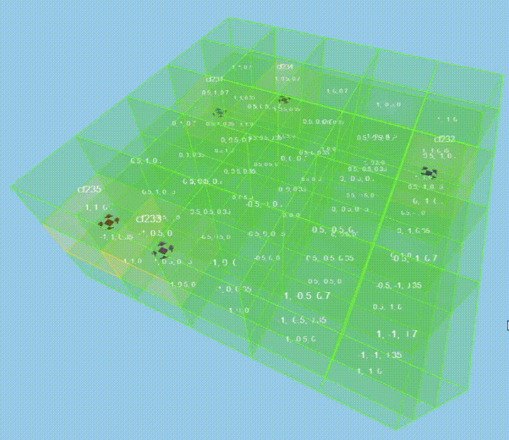
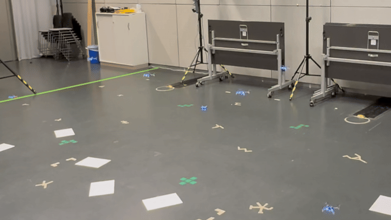

<div align="center">

# FEDT-Bigraph-UAS

[](https://shanecan.github.io/FEDT-Bigrid-UAS/)
[](https://www.youtube.com/watch?v=338XnNnXHFI)
[](LICENSE)
[](https://docs.ros.org/)
[](https://www.dcs.gla.ac.uk/~michele/bigrapher.html)
[](https://www.prismmodelchecker.org/)

</div>

<p align="center">
  
</p>

<p align="center"><em>
Formal Model-Based Executable Digital Twin (FEDT) framework architecture. The pipeline couples physical UAS execution, discrete bigraph-based
reasoning, runtime validation, and monitoring in a closed loop.
</em></p>

## Intro

This project demonstrates how Bigraphs can be used to model and control Crazyflie2.1 drones in simulation or reality. It implements a grid-based, collision-free UAV navigation system using Bigraphical Reactive Systems (BRS), ROS2, and A* path planning. This allows UAVs to fly safely from takeoff to landing in a discretized airspace while maintaining real-time digital twin consistency between the world model, UAV agent model, and live ROS2 data.

<table>
<tr>
<td align="center" valign="middle"></td>
<td align="center" valign="middle"></td>
</tr>
<tr>
<td align="center"><em>Digital twin — live grid occupancy and UAS state</em></td>
<td align="center"><em>Physical layer — indoor Crazyflie testbed</em></td>
</tr>
</table>

## Contributions

1. **A unified bigraph modelling method** for UAS flight operations in discretised 3D airspace,
   integrating airspace topology, occupancy, adjacency, mission phase, battery state, and
   communication state into a single executable runtime representation.

2. **A pre-execution verification and fail-safe mechanism** based on bigraph rewriting. Candidate
   movements and state transitions are executed only when their reaction-rule preconditions hold,
   enforcing grid occupancy exclusion and logical consistency before actuation.

3. **An end-to-end runtime assurance system** with ROS-based UAS execution, model synchronisation,
   and operator monitoring.

The framework is **planner-independent**: it acts as a runtime assurance layer that supervises the
outputs of existing planners or controllers, rather than serving as a trajectory generation or
formation control algorithm.

> Across nine scenarios and 1813 runtime-gate decisions, FEDT recorded **zero grid co-occupancy
> violations**. Full results are on the
> [project page](https://shanecan.github.io/FEDT-Bigrid-UAS/).

## Video

<p align="center">
  <a href="https://www.youtube.com/watch?v=338XnNnXHFI">
    
  </a>
</p>

## Repository layout

| Path | Role |
| --- | --- |
| [`bigrid-provider-service/`](bigrid-provider-service/) | Spring Boot REST API that generates and serves the *bi-grid* — the bigraph world model with grid topology (Ecore XMI / JSON / Protobuf). |
| [`cps.asset.crazyflie/`](cps.asset.crazyflie/) | Cyber-physical representation of the **Crazyflie 2.x** UAS: AeroCtrl state machine, ROS 2 / Crazyswarm2 bridge, Webots simulation, and the web monitoring view. |
| [`bigraphs.drone-collision-free/`](bigraphs.drone-collision-free/) | The FEDT runtime: joint bigraph world + UAS model, A\* path planning, the runtime gate, and CDO model persistence. |
| [`bigrid/`](bigrid/) | BigraphER + PRISM model checking of the reaction-rule set. See [`bigrid/README.md`](bigrid/README.md). |

## Installation

Everything lives in this single repository.

```bash
git clone https://github.com/ShaneCan/FEDT-Bigrid-UAS.git
cd FEDT-Bigrid-UAS
```

### Tested environment

The setup process was tested on Ubuntu 24.04.5 with Kernel 7.0.0-31, using X11 with NVIDIA as well
as AMD integrated graphics. It is verified to be working on ROS versions **Humble** and **Jazzy**,
and known to be broken on ROS Lyrical due to some dependencies not being up-to-date for this
version yet.

### Prerequisites

1. Install Docker and Docker Compose:

```bash
sudo apt install docker-compose-v2 util-linux-extra
sudo usermod -aG docker $USER
newgrp docker   # or re-login
```

2. Install ROS (Jazzy) according to the
   [docs](https://docs.ros.org/en/jazzy/Get-Started/Installation/Ubuntu-Install-Debs.html). Make
   sure to install `ros-$ROS_DISTRO-desktop` instead of the barebones install. Append
   `source /opt/ros/$ROS_DISTRO/setup.bash` to `$HOME/.bashrc`.

3. Install further dependencies:

```bash
sudo apt-get install ros-dev-tools ros-$ROS_DISTRO-rosbridge-server tmux
```

### Build the modules

1. Build the Docker container for Webots and DS-Crazyflies:

```bash
cd cps.asset.crazyflie/simulation/ds-crazyflies-ext
./prepare.sh --linux
cd simulation.ds-crazyflies/docker
docker compose build
```

2. Build the FEDT runtime:

```bash
cd bigraphs.drone-collision-free
chmod +x mvnw
./mvnw clean package -DskipTests
```

3. Build the bi-grid provider service:

```bash
cd bigrid-provider-service
chmod +x mvnw
./mvnw clean package -DskipTests
```

## Usage

Launching the system involves several steps, so we recommend launching with
[tmux](https://tmux.app/), which will start all processes in a joint terminal window that can be
terminated with <kbd>Ctrl</kbd>+<kbd>Q</kbd>. After completing the setup process, run:

```bash
./launch_application.sh [ROS_VERSION]
```

By default the script uses `$ROS_DISTRO` to determine the ROS distribution. If you want to use a
different version, specify this as a launch argument.

To use the system with real Crazyflie drones, refer to the docs in
[`cps.asset.crazyflie/`](cps.asset.crazyflie/) for setup information.

## Model checking

The reaction-rule set is verified independently of the running system. The bigraphical reactive
system is exported as a DTMC with **BigraphER** and checked with **PRISM**, confirming that no two
UAS ever occupy the same grid cell and that no landed UAS is left at an air locale.

- Install BigraphER via opam following the
  [official instructions](https://www.dcs.gla.ac.uk/~michele/bigrapher.html#opam).
- Install [PRISM](https://www.prismmodelchecker.org/download.php).

```bash
cd bigrid
bash run_verified_analysis.sh        # exhaustive verification of the 2x2x2 configuration
bash verification_analysis.sh 2000   # bounded exploration of the 3x3x3 configuration
```

See [`bigrid/README.md`](bigrid/README.md) for the models, the properties that are checked, and the
expected output.

## Citation

```bibtex
@article{zhang2026fedt,
  title  = {Runtime-Assured Digital Twins for Safe UAS Operations in Gridded Airspace},
  author = {Zhang, Tianxiong and Grzelak, Dominik and Victor, Victor and
            Sevegnani, Michele and Fricke, Hartmut and A{\ss}mann, Uwe},
  year   = {2026}
}
```

## License

Released under the [MIT License](LICENSE).
